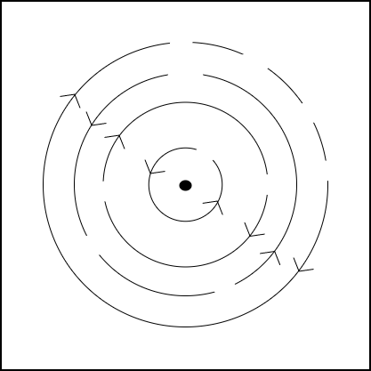
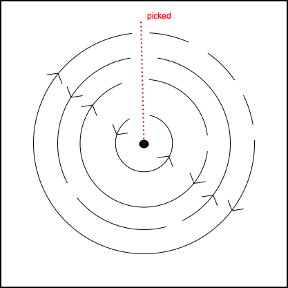

The Picker
==========
.
.

Implemented in the challenge script is a lock.
The lock consists of 4 tumblers, each with its own set of pins.
Tumblers are essentially concentric circles and pins are essentially circle arcs.

The goal is to determine which pins are aligned when the lock is pickable for the first time. That is, when some combination of tumbler pins overlap.

[These](https://en.wikipedia.org/wiki/Pin_tumbler_lock#Design) diagrams might help.

You could try solving this puzzle with math alone.

But you could also try to solve it by filling out the body of `Lock::pick`.

The flag takes the following form:
[SPINS]-[PIN COMBINATION]

where SPINS is the value of `Lock::spins` when the pins are aligned and PIN COMBINATION is the index of the pin at each tumbler.
For example, if the first time the lock is pickable is after 3 spins and the alignment is tumbler0's pin0, tumbler1's pin1, tumbler2's pin2, and tumbler3's pin3 then the flag would be:
3-0123
